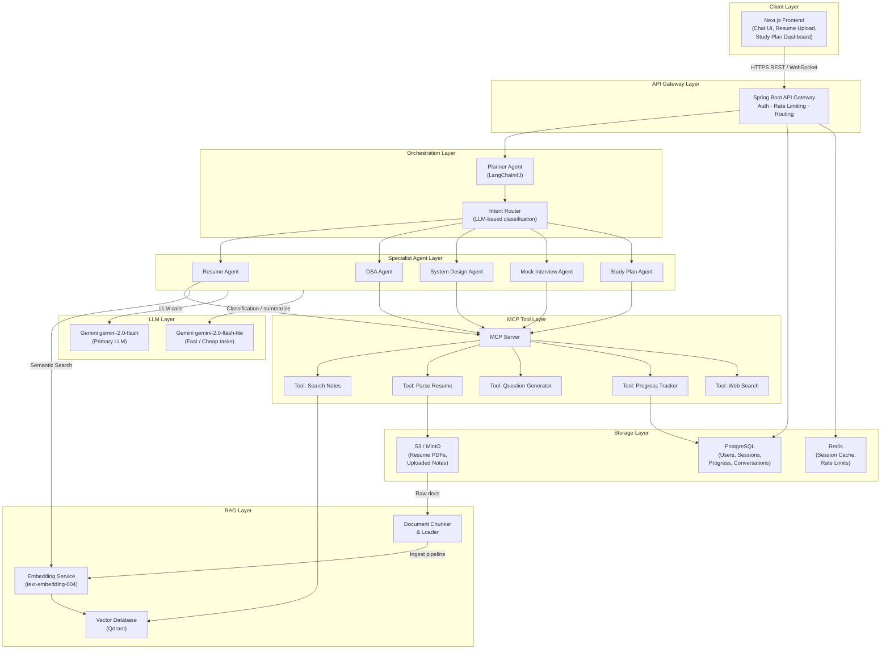
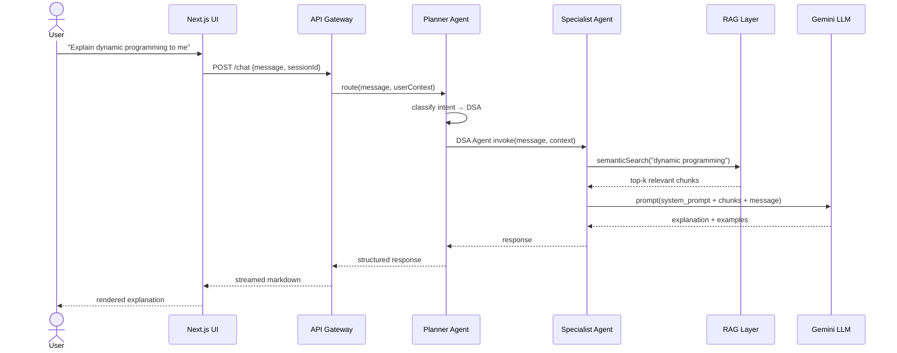
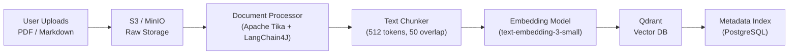
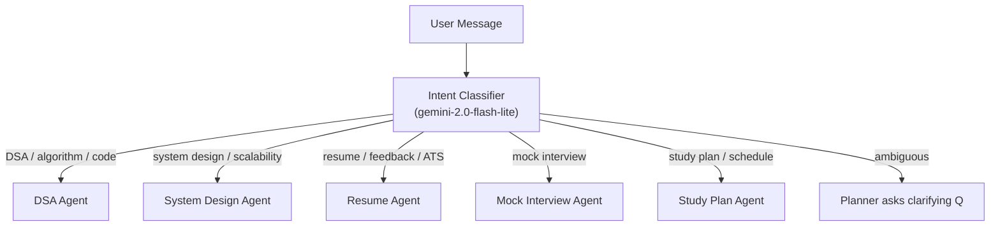

# MarxAI — High Level Architecture

## System Overview

MarxAI is an AI-powered Software Engineering Coach that acts as a personalized mentor for interview preparation. It combines RAG (Retrieval-Augmented Generation), Agentic AI, and LLM Orchestration to deliver context-aware coaching across DSA, System Design, and resume feedback.

---

## High Level Architecture Diagram

---

## User Journeys

---

## Data Flow — Document Ingestion

---

## Agent Routing Logic

---

## Key Architectural Decisions

| Concern | Decision | Rationale |
|---|---|---|
| Orchestration | LangChain4J Planner Agent | Native Java, integrates with Spring Boot, supports tool calling |
| Vector DB | Qdrant | Self-hostable, fast, supports metadata filtering |
| LLM | Gemini `gemini-2.0-flash` | Best reasoning, long context for documents |
| Fast tasks | Gemini `gemini-2.0-flash-lite` | Classification & summarization at low cost |
| Streaming | WebSocket / SSE | Real-time chat UX |
| Auth | JWT + Spring Security | Stateless, scalable |
| Storage | MinIO (local) / S3 (prod) | Unified S3-compatible API |
