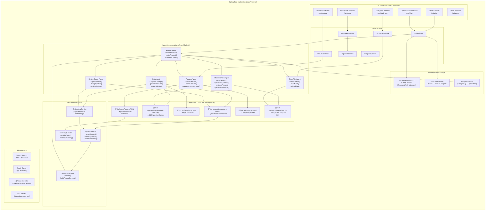
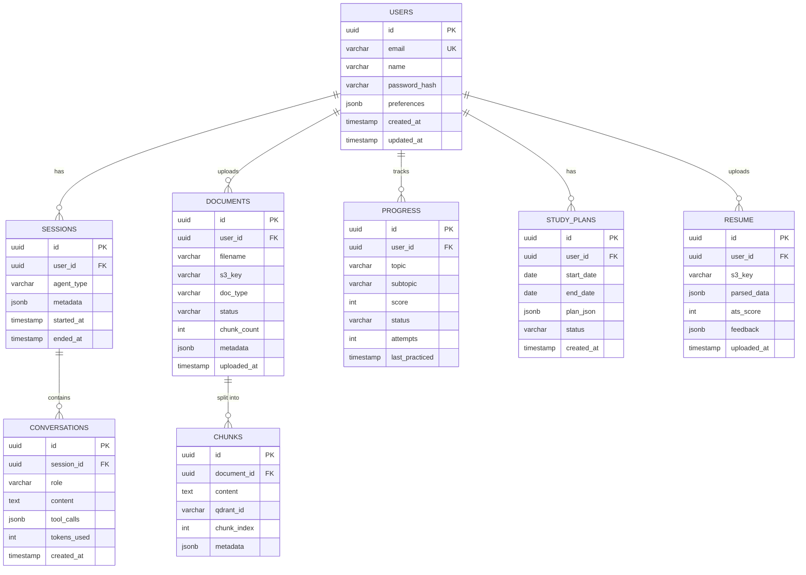
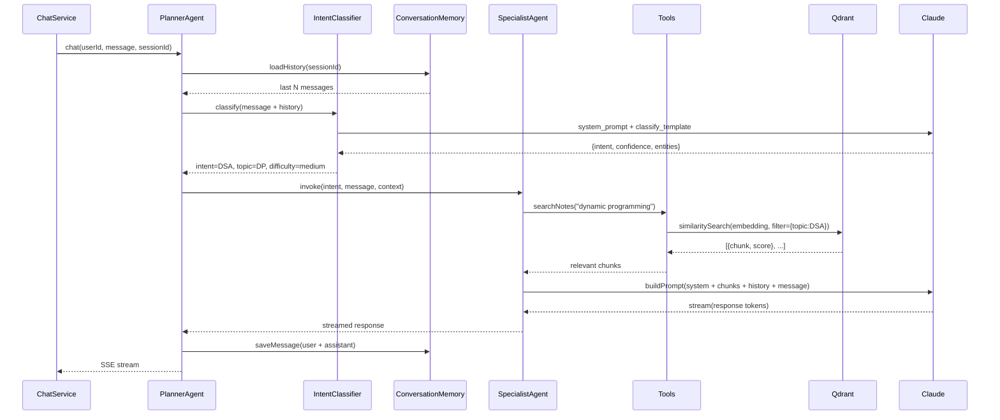
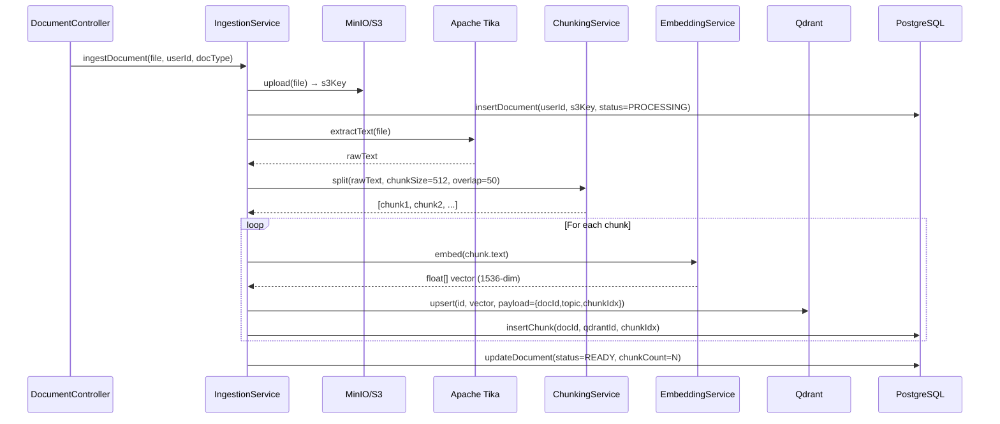
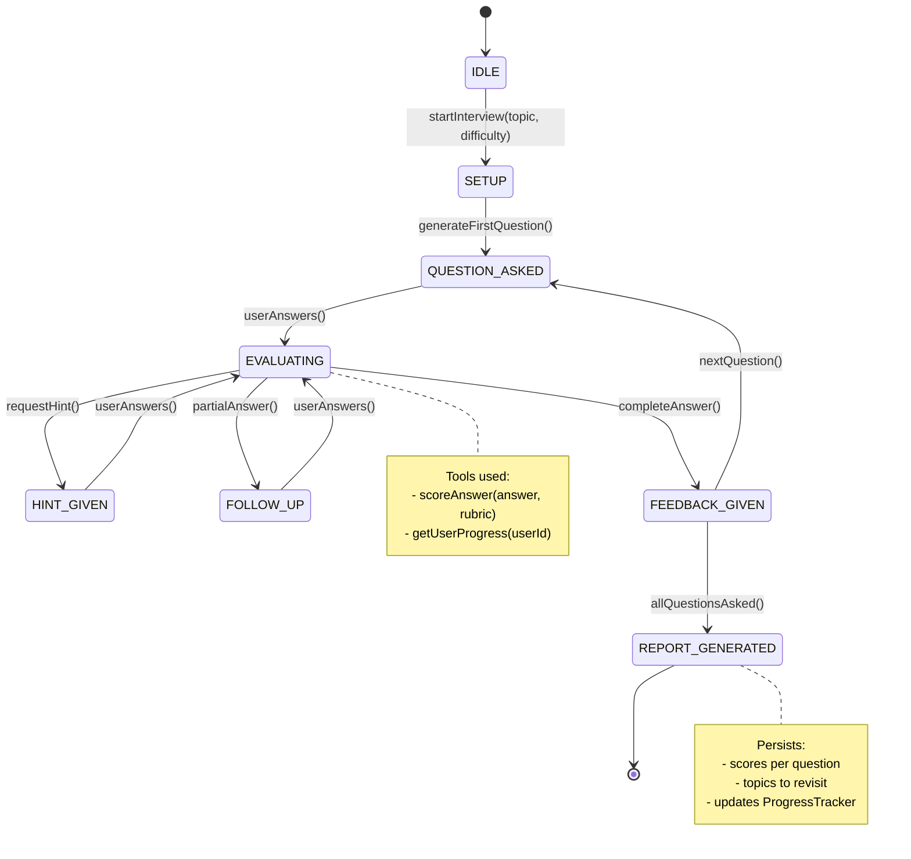
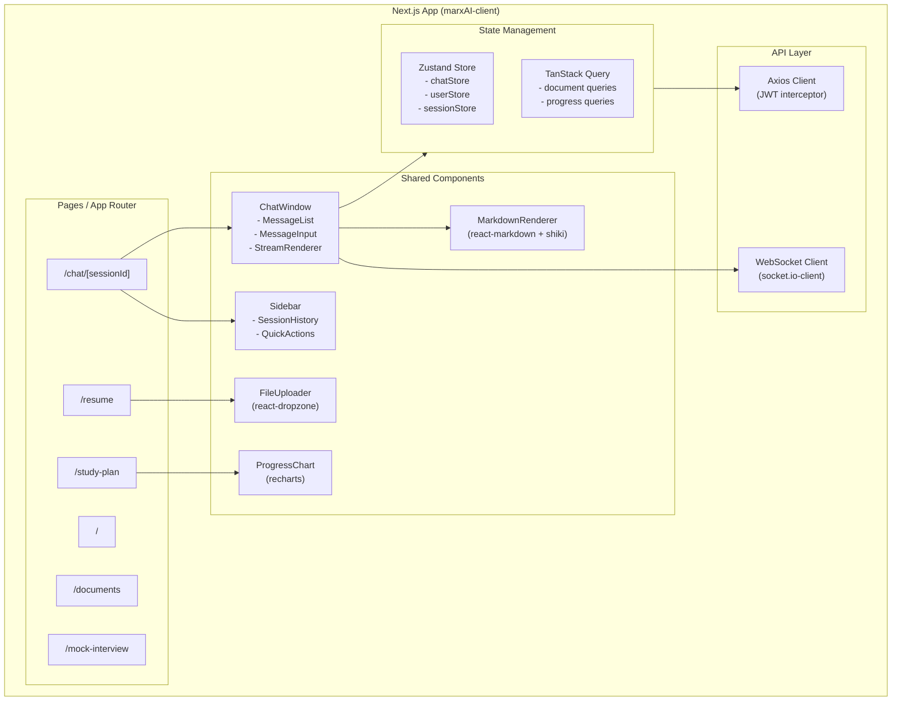
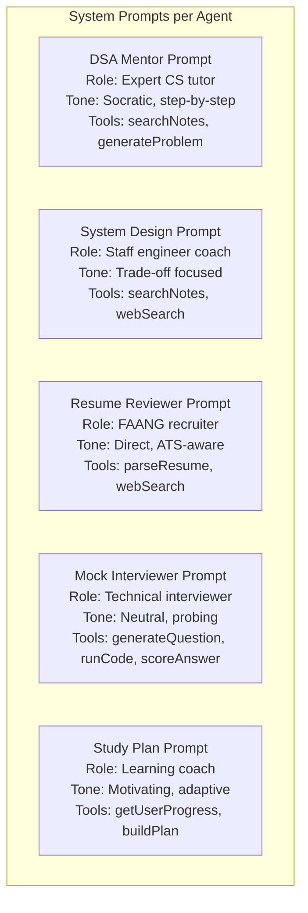

# MarxAI — Low Level Architecture

## Backend Service Breakdown

---

## Database Schema

---

## Planner Agent — Internal Flow

---

## RAG Pipeline — Document Ingestion

---

## Mock Interview Agent — State Machine

---

## Frontend Component Architecture

---

## Prompt Engineering Templates

