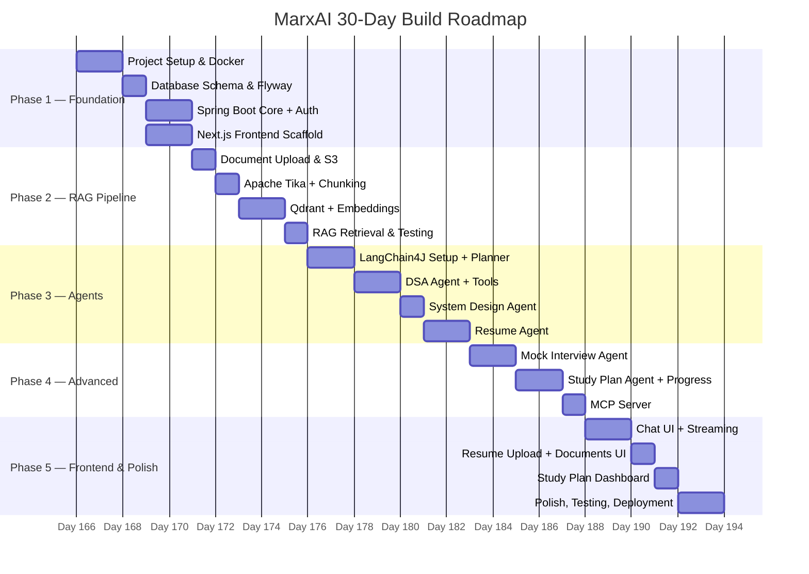

# MarxAI — 30-Day Build Roadmap

## Overview

---

## Week 1 — Foundation & Infrastructure (Days 1–7)

### Day 1–2: Project Setup & Docker

**Goal:** Working local dev environment with all services running.

- [x] Initialize Spring Boot project (Maven, Java 21, Spring Boot 3.3)
  - Dependencies: Spring Web, Spring Security, Spring Data JPA, Spring WebSocket, Validation, Actuator
- [x] Initialize Next.js project with TypeScript + Tailwind + shadcn/ui
- [x] Create `docker-compose.yml` with:
  - PostgreSQL 16
  - Redis 7
  - Qdrant (latest)
  - MinIO
- [x] Configure `application-dev.yml` with datasource, Redis, MinIO endpoints
- [x] Verify all services healthy via Docker healthchecks

**Deliverable:** `docker-compose up` → all services green

---

### Day 3: Database Schema & Flyway

**Goal:** Full schema defined and versioned.

- [x] Add Flyway dependency, configure baseline migration
- [x] `V1__create_users.sql` — users table
- [x] `V2__create_sessions.sql` — sessions + conversations
- [x] `V3__create_documents.sql` — documents + chunks
- [x] `V4__create_progress.sql` — progress + study_plans
- [x] `V5__create_resume.sql` — resume table
- [x] Create all JPA entities + repositories

**Deliverable:** `mvn flyway:migrate` runs clean; entities map to tables

---

### Day 4–5: Spring Boot Core + JWT Auth

**Goal:** Secure REST API backbone working end-to-end.

- [x] `UserController` — register, login, profile
- [x] JWT auth with JJWT: `JwtService`, `JwtFilter`, `SecurityConfig`
- [x] `UserService` + BCrypt password hashing
- [x] Global exception handler (`@RestControllerAdvice`)
- [x] Basic DTOs with validation (`@Valid`)
- [x] Postman collection: register → login → get token → call protected endpoint

**Deliverable:** Auth flow working, JWT returned on login

---

### Day 6–7: Next.js Frontend Scaffold

**Goal:** Login/Register UI connected to backend.

- [x] Project structure: `app/`, `components/`, `store/`, `lib/`, `types/`
- [x] Axios client with JWT interceptor (auto-attach + 401 redirect)
- [x] Zustand `userStore` (auth state, token)
- [x] `/login` and `/register` pages with form validation
- [x] Protected route wrapper (redirect if no token)
- [x] Basic layout: sidebar + main content area
- [x] Dark mode toggle with Tailwind

**Deliverable:** Can register, login, and see a protected dashboard

---

## Week 2 — RAG Pipeline (Days 8–14)

### Day 8: Document Upload & S3

**Goal:** Files upload to MinIO and are tracked in DB.

- [x] Add MinIO Java SDK dependency
- [x] `MinioConfig.java` — configure MinIO client bean
- [x] `StorageService.java` — `uploadFile()`, `downloadFile()`, `getPresignedUrl()`
- [x] `DocumentController` — `POST /api/docs/upload` (multipart)
- [x] `IngestionService` — save metadata to PostgreSQL, return docId
- [x] File type validation (PDF, MD, TXT only)

**Deliverable:** Upload PDF → stored in MinIO → record in PostgreSQL

---

### Day 9: Apache Tika + Chunking Service

**Goal:** Extract text from PDFs and split into RAG-ready chunks.

- [x] Add Apache Tika dependency
- [x] `TikaDocumentParser.java` — extract text from PDF/DOCX/MD
- [x] `ChunkingService.java`:
  - Token-aware splitting (512 tokens per chunk)
  - 50-token overlap between chunks
  - Metadata per chunk: `{docId, chunkIndex, pageNumber, topic}`
- [x] Unit tests for chunking edge cases (short docs, multi-page PDFs)

**Deliverable:** Given a PDF → list of `Chunk` objects with text + metadata

---

### Day 10–11: Qdrant Integration + Embeddings

**Goal:** Chunks embedded and stored; semantic search working.

- [x] Add LangChain4J + Qdrant dependency
- [x] `EmbeddingService.java` — call Gemini embedding API (`text-embedding-004`)
- [x] `QdrantConfig.java` — configure `QdrantEmbeddingStore`
- [x] `QdrantService.java`:
  - `upsertChunks(List<Chunk>)` — embed + store with metadata
  - `similaritySearch(query, topK, filter)` — returns relevant chunks
  - `deleteByDocumentId(docId)` — cleanup on doc deletion
- [x] Wire `IngestionService`: upload → parse → chunk → embed → upsert
- [x] Async ingestion with `@Async` (don't block upload response)

**Deliverable:** Upload PDF → background ingestion → search Qdrant → relevant chunks returned

---

### Day 12: RAG Retrieval & Context Assembly

**Goal:** Full RAG pipeline returns enriched context for LLM.

- [x] `ContextAssembler.java`:
  - Takes top-k chunks from Qdrant
  - Deduplicates by content hash
  - Formats into `### Source N:\n{chunk}` structure
  - Truncates to fit within context window
- [x] `EmbeddingStoreRetriever` from LangChain4J wired up
- [x] Add metadata filtering by `docType` (DSA / SystemDesign / Resume)
- [x] Integration test: query "binary search" → returns DSA note chunks

**Deliverable:** RAG retrieval returns ranked, formatted context ready for prompt injection

---

### Day 13–14: Document Management UI

**Goal:** Users can upload, view, and manage their knowledge base.

- [ ] `/documents` page with upload dropzone (react-dropzone)
- [ ] Document list table: filename, type, status (Processing / Ready), upload date
- [ ] Real-time status polling (TanStack Query, refetch every 3s while PROCESSING)
- [ ] Delete document with confirmation modal
- [ ] Toast notifications for upload success/failure

**Deliverable:** Upload DSA notes PDF → see it appear as Ready → can search it

---

## Week 3 — Agents (Days 15–21)

### Day 15–16: LangChain4J Setup + Planner Agent

**Goal:** Core agent infrastructure with intent routing working.

- [ ] Add LangChain4J `langchain4j-google-ai-gemini` dependency (already in build)
- [ ] `LangChainConfig.java`:
  - `ChatLanguageModel` bean (`gemini-2.0-flash`, streaming)
  - `ChatLanguageModel` fast bean (`gemini-2.0-flash-lite`)
  - `MessageWindowChatMemory` factory
- [ ] Define agent interface pattern (`AiServices.create()`)
- [ ] `IntentClassifier.java`:
  - Uses `gemini-2.0-flash-lite`
  - Returns `{intent, confidence, topic, difficulty, entities}`
  - Intent enum: `DSA | SYSTEM_DESIGN | RESUME | MOCK_INTERVIEW | STUDY_PLAN | GENERAL`
- [ ] `PlannerAgent.java`:
  - Injects memory, user context, intent
  - Routes to specialist agent
  - `ChatService` orchestrates the full call

**Deliverable:** Message "explain binary trees" → classified as DSA → routed correctly

---

### Day 17–18: DSA Agent + Tools

**Goal:** First fully functional agent: explains DSA, generates problems, reviews code.

- [ ] System prompt: `DSA_MENTOR_PROMPT` (Socratic, step-by-step, hints before answers)
- [ ] `NoteSearchTool.java` — `@Tool` → calls `QdrantService.similaritySearch()`
- [ ] `QuestionGeneratorTool.java` — `@Tool` → LLM generates problem by topic + difficulty
- [ ] `CodeRunnerTool.java` — `@Tool` → calls Judge0 API, returns output + runtime
- [ ] Wire tools into `DSAAgent` via `AiServices`
- [ ] `ChatController` — `POST /api/chat` and SSE streaming endpoint `/api/chat/stream`
- [ ] `ChatWebSocketHandler` for WebSocket support

**Deliverable:** Chat "give me a medium DP problem with hints" → agent responds with problem, accepts user code, runs it, gives feedback

---

### Day 19: System Design Agent

**Goal:** System design explanations and review.

- [ ] System prompt: `SYSTEM_DESIGN_PROMPT` (trade-offs focused, staff-engineer voice)
- [ ] Reuse `NoteSearchTool` with `docType=SYSTEM_DESIGN` filter
- [ ] `WebSearchTool.java` — `@Tool` → calls Tavily API for up-to-date examples
- [ ] `SystemDesignAgent.java` wired with tools
- [ ] Test: "Design a URL shortener" → structured response with components, trade-offs, scale considerations

**Deliverable:** System design questions answered with relevant notes + web context

---

### Day 20–21: Resume Agent

**Goal:** Resume parsing, ATS scoring, and improvement suggestions.

- [ ] System prompt: `RESUME_REVIEWER_PROMPT` (FAANG recruiter, ATS-aware, direct feedback)
- [ ] `ResumeParseTool.java` — `@Tool` → fetches PDF from S3 → Tika extraction → structured JSON
- [ ] `ResumeAgent.java`:
  - `parseAndScore(resumeId)` — parse + ATS score + categorized feedback
  - `suggestImprovements(section)` — targeted suggestions per section
  - `tailorForRole(resumeId, jobDescription)` — tailor bullet points
- [ ] `ResumeController` — `POST /api/resume/upload`, `GET /api/resume/{id}/score`
- [ ] Store ATS score + feedback JSON in `resume` table

**Deliverable:** Upload resume → ATS score (0–100) + section-by-section feedback

---

## Week 4 — Advanced Features & Polish (Days 22–30)

### Day 22–23: Mock Interview Agent

**Goal:** End-to-end mock interview with real-time feedback.

- [ ] System prompt: `MOCK_INTERVIEWER_PROMPT` (neutral, probing, no hints unless asked)
- [ ] State machine: `SETUP → QUESTION → EVALUATING → FEEDBACK → NEXT / REPORT`
- [ ] Interview session model: topic, difficulty, number of questions, time limit
- [ ] `MockInterviewAgent`:
  - `startSession(config)` → generates question set plan
  - `nextQuestion()` → delivers next question
  - `evaluateAnswer(answer)` → scores against rubric (correctness, efficiency, clarity)
  - `generateReport()` → summary with per-question scores + topics to revisit
- [ ] Session state persisted in Redis (active) + PostgreSQL (completed)
- [ ] `/mock-interview` page: timer, question display, answer textarea, live feedback

**Deliverable:** Complete 5-question mock interview → receive detailed performance report

---

### Day 24–25: Study Plan Agent + Progress Tracking

**Goal:** Adaptive study plans based on user progress.

- [ ] `ProgressTrackerTool.java` — `@Tool` → reads `progress` table (topic scores, last practiced, attempt count)
- [ ] `StudyPlanAgent`:
  - `assessLevel(userId)` → analyzes progress → weak topic identification
  - `buildPlan(userId, targetDate, hoursPerDay)` → day-by-day study plan JSON
  - `adjustPlan(userId, feedback)` → modifies plan based on progress
- [ ] `ProgressService` — update topic scores after each DSA/SD session
- [ ] `StudyPlanController` — `POST /api/study-plan/generate`, `GET /api/study-plan/current`
- [ ] `/study-plan` page: calendar view, daily tasks, progress bars per topic

**Deliverable:** Generate personalized 30-day plan based on weak topics → track completion

---

### Day 26: MCP Server

**Goal:** Expose all tools via Model Context Protocol for extensibility.

- [ ] Research LangChain4J MCP support or implement custom MCP adapter
- [ ] `McpServer.java` — wraps existing `@Tool` beans into MCP tool schema
- [ ] Tool manifest: `searchNotes`, `parseResume`, `generateQuestion`, `getUserProgress`, `webSearch`, `runCode`
- [ ] MCP endpoint: `GET /mcp/tools` (list), `POST /mcp/tools/{name}` (invoke)
- [ ] Test with MCP client (custom test harness or compatible MCP inspector)

**Deliverable:** All tools callable via standard MCP protocol

---

### Day 27–28: Chat UI + Streaming Frontend

**Goal:** Production-quality chat interface with real-time streaming.

- [ ] `ChatWindow` component:
  - Message list with user/assistant bubble distinction
  - Streaming token renderer (append characters as they arrive)
  - Code block with syntax highlighting (shiki) + copy button
  - Markdown rendering (react-markdown)
- [ ] Session history sidebar: list of past conversations, new chat button
- [ ] Agent type selector: Mentor / Interviewer / Resume Reviewer / Study Planner
- [ ] Typing indicator while waiting for first token
- [ ] Error states: connection lost, rate limit, retry button
- [ ] WebSocket reconnection with exponential backoff

**Deliverable:** Smooth chat UI that streams responses token by token

---

### Day 29: Resume & Documents UI Polish

**Goal:** Complete UI for resume management and document knowledge base.

- [ ] `/resume` page: upload area, current resume display, ATS score badge, feedback accordion (by section)
- [ ] "Tailor for role" flow: paste job description → get tailored bullet points
- [ ] `/documents` page polish: topic tags, search/filter, re-ingest button
- [ ] Progress dashboard widgets: radar chart (topic coverage), streak calendar, weekly goals
- [ ] Mobile-responsive layout check

**Deliverable:** All UI pages functional and visually polished

---

### Day 30: Testing, Deployment & Wrap-up

**Goal:** Ship it.

**Testing:**
- [ ] Unit tests: `ChunkingService`, `ContextAssembler`, `IntentClassifier`, JWT utils
- [ ] Integration tests: full RAG pipeline (upload → embed → search)
- [ ] Agent smoke tests: one message per agent type, verify tool calls fire
- [ ] E2E: register → upload note → chat → get answer referencing note

**Deployment:**
- [ ] Dockerize Spring Boot app (`Dockerfile`, multi-stage build)
- [ ] `docker-compose.prod.yml` for production config
- [ ] GitHub Actions CI: build → test → Docker build → push to registry
- [ ] Deploy backend to Railway or AWS EC2
- [ ] Deploy frontend to Vercel
- [ ] Configure production secrets (Gemini API key, DB URL)
- [ ] Set up Qdrant Cloud (or Qdrant on EC2)
- [ ] Health check endpoint + basic monitoring

**Deliverable:** Live URL, all features working in production

---

## Daily Checklist Template

Each day, before ending:
- [ ] Code committed with meaningful message
- [ ] Feature manually tested (not just compiled)
- [ ] Any blockers noted for next session
- [ ] `docker-compose up` still works clean

---

## Risk Register

| Risk | Mitigation |
|---|---|
| LangChain4J API changes | Pin exact version in pom.xml; check changelog before upgrading |
| Qdrant embedding dimension mismatch | Set dimension once at collection creation; never change model mid-project |
| Gemini rate limits during testing | Use `gemini-2.0-flash-lite` for dev/test; `gemini-2.0-flash` only for eval |
| Judge0 latency for code execution | Show "Running..." spinner; 10s timeout with user-friendly error |
| Context window overflow on large PDFs | Chunk + truncate at `ContextAssembler`; max 5 chunks per query |
| JWT secret in code | Use environment variable `JWT_SECRET`; never commit to git |

---

## Milestones Summary

| Milestone | Day | What You Can Demo |
|---|---|---|
| Local dev running | 2 | All Docker services up, Spring Boot starts |
| Auth working | 5 | Register, login, get JWT |
| RAG pipeline | 12 | Upload PDF → search retrieves relevant chunks |
| First agent (DSA) | 18 | End-to-end chat with note context |
| All agents | 21 | All 5 agents respond correctly |
| Mock interview | 23 | Full interview session with report |
| Study plan | 25 | Personalized plan generated from progress |
| Production deploy | 30 | Live URL, full feature set |
